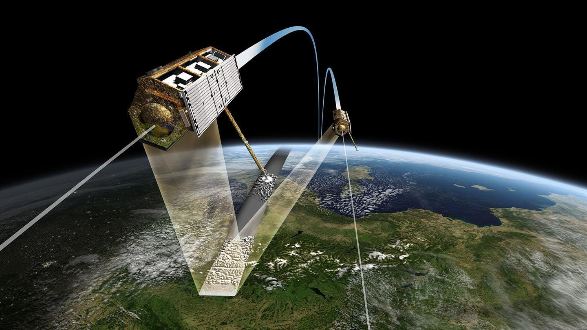

# Digital elevation map for the Lisbon city center


As it is well known, the altitude GPS data is not accurate enough to be used in the modeling , so I needed to came up to another solution that corrected the low-quality of altitude data. I have built a digital elevation data for the Lisbon city center, i.e., the region where the tuk-tuk usually operates in. This map was built we help of mapbox in python 3 by using their mapbox-terrain-RGB API. This API provides one heigh measurement increment of 0.1-meter for each square area of 17.5 m2. It is an easy-to-use API, so obtaining the altitudes data is as straightforward as simply
passing the pair of coordinate of points (latitude, longitude). Nevertheless, Mapbox obtains the elevation data thanks to the realization of the Copernicus EU program, which is an international research effort that provides the Digital Elevation Model (DEM) almost all over the land (from 56◦S to 60◦N). These data are generated from a weighted average of Shuttle Radar Topography Mission (SRTM) and Advanced Spaceborne Thermal Emission and Reflection Radiometer (ASTERM) [54]. Both datasets provide one altitude measurement for every square area of 900 m2, which translates into one measurement for every  30 m.





## Usage


```python
# Import the necessary packages for this repo
from TilesDownloader import build_canvas

# Create the estimator by passing model parameters
kalman = RobustKalman(F, B, H, x0, P0, Q0, R0, use_robust_estimation=True)

# ...

# Do updates on every time step
kalman.time_update()
kalman.measurement_update(measurements)

# ...

# Get the estimations
print('Current state estimates', kalman.current_estimate)

```

## Authors
José Veiga
David Neto

